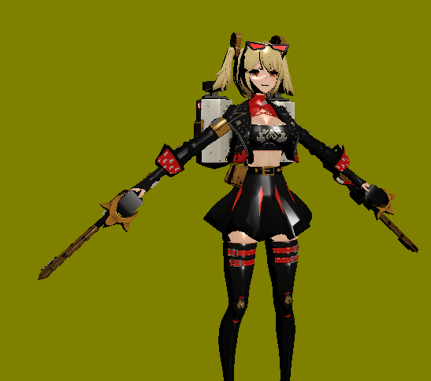
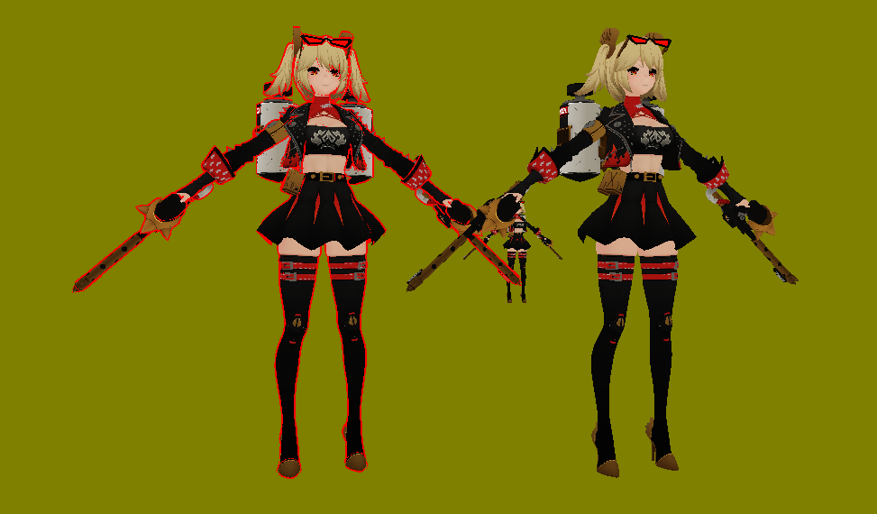
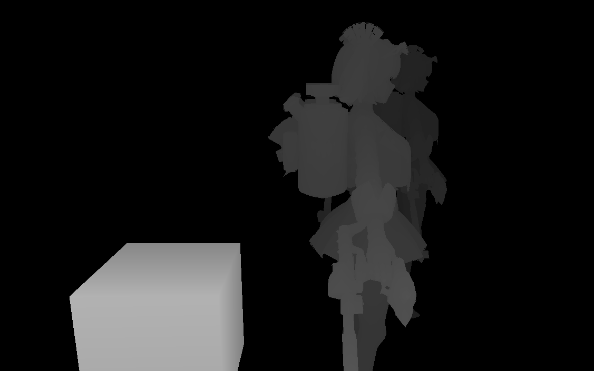
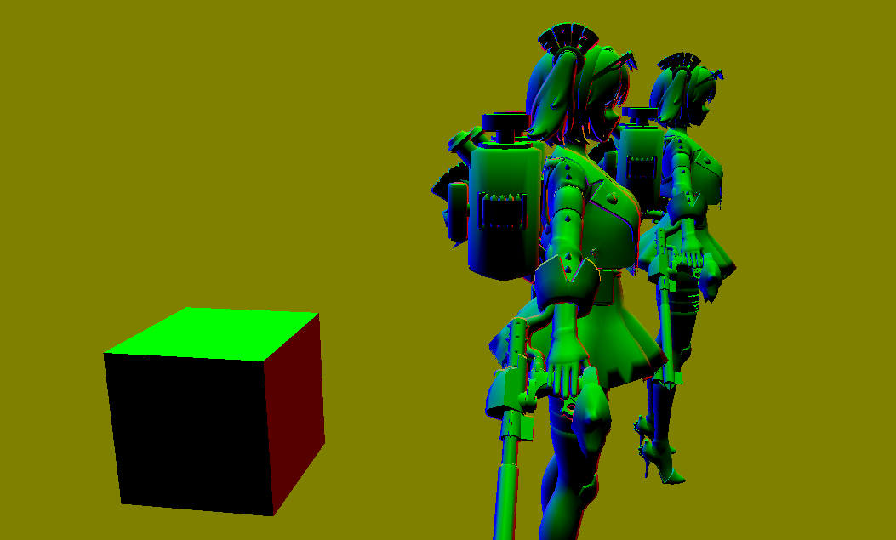

# DirectX 11 Toy Project

## Cartoon Rendering

| Feature | Preview |
|--------|---------|
| [Cartoon Diffuse / Specular](https://velog.io/@wltnwkd21/DX11-tutorial-2-cartoon-diffuse-specular-%EA%B5%AC%ED%98%84) |  |
| [Cartoon Outline](https://velog.io/@wltnwkd21/DX11-tutorial-3-cartoon-outline-%EA%B5%AC%ED%98%84) |  |

## GBuffer

| Buffer Type | Preview |
|------------|---------|
| [GBuffer - Depth](https://velog.io/@wltnwkd21/DX11-GBuffer-%EA%B5%AC%ED%98%84) |  |
| [GBuffer - Normal](https://velog.io/@wltnwkd21/DX11-GBuffer-%EA%B5%AC%ED%98%84) |  |

## Text Rendering

| Feature | Preview |
|--------|---------|
| [Text Rendering (GPU Instancing)](https://velog.io/@wltnwkd21/DX11-GPU-Instancing-%EA%B8%B0%EB%B0%98-%ED%85%8D%EC%8A%A4%ED%8A%B8-%EB%A0%8C%EB%8D%94%EB%A7%81) |  |


## Directory Structure

```
DX11/
│
├─ main.cpp # Entry point of the application
├─ main.h # Main application header
│
├─ data/ # Static resources used by the application
│
├─ hlsl/ # HLSL shader source files
│
├─ include/ # Public header files (accessible by all modules)
│ ├─ camera/ 
│ ├─ framework/ # Core framework headers (e.g., applicationclass.h) 
│ ├─ light/
│ ├─ model/  # Classes representing models (e.g., Bitmap, GLB)
│ ├─ shader/  # Classes for rendering
│ ├─ texture/
│ ├─ utility/ # General-purpose utilities (json, parser, tiny_gltf, etc.)
│
├─ log/ # Application log files and debug outputs
│
├─ source/ # Source (.cpp) implementations
│ ├─ The folder structure is the same as in the include/ directory
```